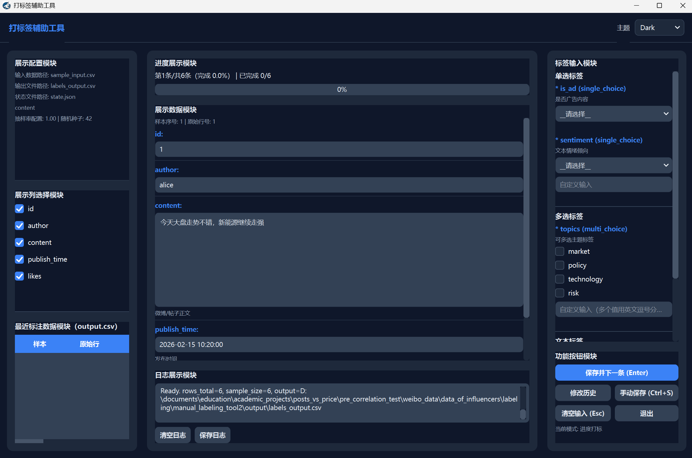

# 通用图形化打标签辅助工具

一个可以高度自定义的图形化打标签辅助工具，支持逐条展示数据内容、自定义单选/多选/文本标签，适用于各种文本分类、信息抽取等标注任务。工具基于 PyQt6 实现，提供友好的用户界面和流畅的交互体验，同时支持前置筛选函数自动填写标签、断点续打、历史修改等实用功能。



## 1. 功能概览
- 支持 CSV 数据源读取（`pandas` 主路径 + `csv` 模块兜底）。
- 支持标签类型：`single_choice`、`multi_choice`、`text`。
- 支持单选/多选标签自定义输入。
- 支持抽样率 `0~1`。
- 支持可配置前置筛选函数（每列可绑定一个筛选文件）。
- 支持自动保存、手动保存、断点续打、历史修改。
- 输出 CSV 包含原始列 + 标签列；日志追加写入。

## 2. 依赖安装
```bash
python -m pip install -r requirements.txt
```

## 3. 运行方式
```bash
python main.py --config config.yaml
```

## 4. 界面架构说明（PyQt6）
界面采用“三栏 + 顶部通栏”结构：
- 顶部通栏：工具标题 + 主题切换（`Light / Dark`）。
- 左侧栏：
  - 展示配置（路径、抽样率、筛选函数摘要）
  - 展示列选择（勾选列名后实时生效）
  - 最近标注数据（最近 10 条，点击可进入历史编辑）
- 中间主区：
  - 进度模块（`第X条/共Y条` + 进度条）
  - 当前样本展示模块（字段卡片式，而非大段纯文本）
  - 日志模块（实时日志 + 清空/保存日志副本）
- 右侧栏：
  - 标签输入模块（单选/多选/文本分组）
  - 功能按钮模块（确认保存、下一条、修改历史、手动保存、退出）

## 5. 交互说明
- `Enter`：保存并下一条。
- `Esc`：优先清空当前焦点输入框；若无焦点则清空当前样本全部输入。
- `Ctrl+S`：手动保存当前样本。
- 点击“最近标注数据”中的行：进入历史编辑模式。
- 必填项会有 `*` 标记和实时校验提示。

## 6. 配置文件说明
配置文件示例见 `config.yaml`，核心字段：
- `paths.input_csv`：输入 CSV 路径
- `paths.output_csv`：标签结果输出 CSV 路径
- `paths.log_file`：日志文件路径
- `paths.state_file`：断点续打状态文件路径
- `sampling_rate`：抽样率（0~1）
- `display_columns`：默认展示列
- `labels`：标签定义列表
- `pre_filters`：前置筛选文件映射（列名 -> Python 文件路径）
- `filter_reject_value`：筛选不通过时写入的默认值
- `log_filter_actions`：是否记录 filter 自动填写日志（默认 `false`）
- `ui.theme`：界面主题（`Light` 或 `Dark`）
- `ui.icon`：窗口图标路径（可选，支持 `.ico/.png`）
- `ui.geometry`：窗口尺寸（如 `1400x900`）

## 7. 前置筛选函数说明
示例：`filters/content_filter.py`

函数签名：
```python
def filter_row(columns: List[str], row: Dict[str, str]) -> Dict[str, Any]:
    ...
```

返回值语义：
- 返回字典的 `key` 必须是标签 `key`（不是 `name`）
- 若某个 `key` 的 `value` 为 `[]`：该标签需要人工填写
- 若某个 `key` 的 `value` 非 `[]`：该标签由 filter 自动填写为该值
- 若某个标签 `key` 没有出现在返回字典中：自动写入 `filter_reject_value`

## 8. 目录结构
```text
.
├─ main.py
├─ config.yaml
├─ requirements.txt
├─ README.md
├─ STYLE_GUIDE.md
├─ RUNNING_GUIDE_PYQT6.md
├─ UI_DESIGN_NOTES.md
├─ data/
│  └─ sample_input.csv
├─ filters/
│  └─ content_filter.py
├─ output/
└─ labeling_tool/
   ├─ __init__.py
   ├─ models.py
   ├─ config_manager.py
   ├─ data_manager.py
   ├─ filter_loader.py
   ├─ storage.py
   ├─ session_logger.py
   └─ gui.py
```
